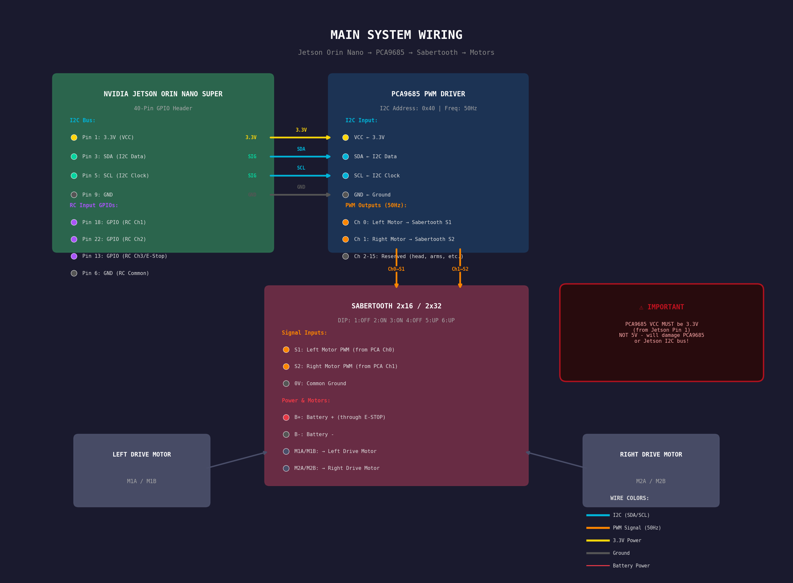
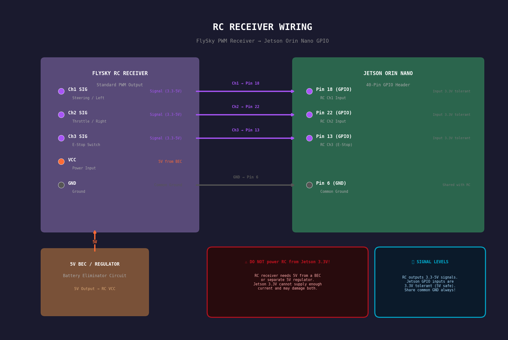
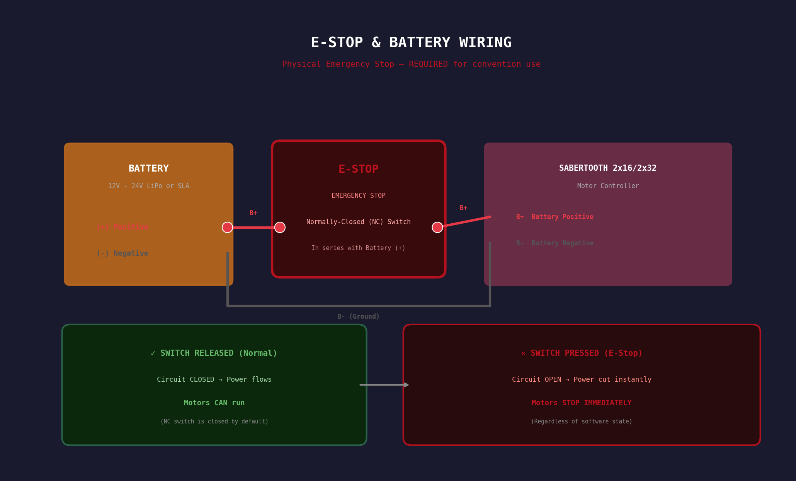
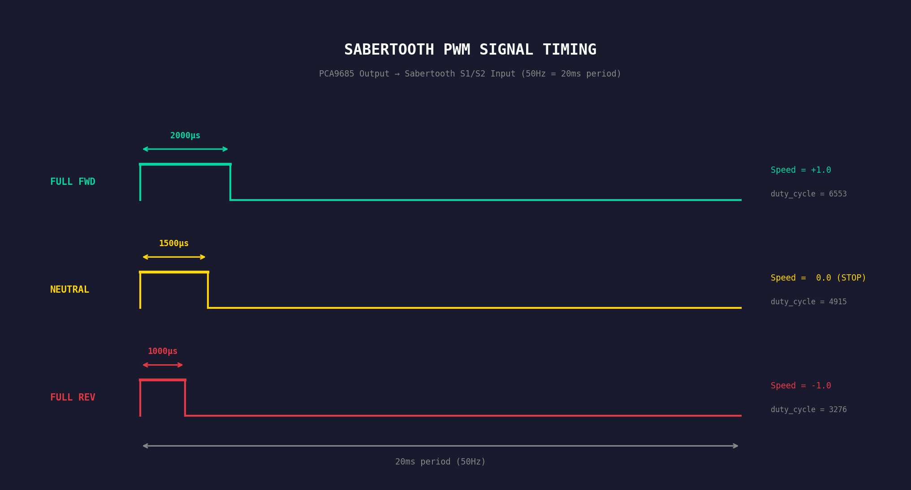
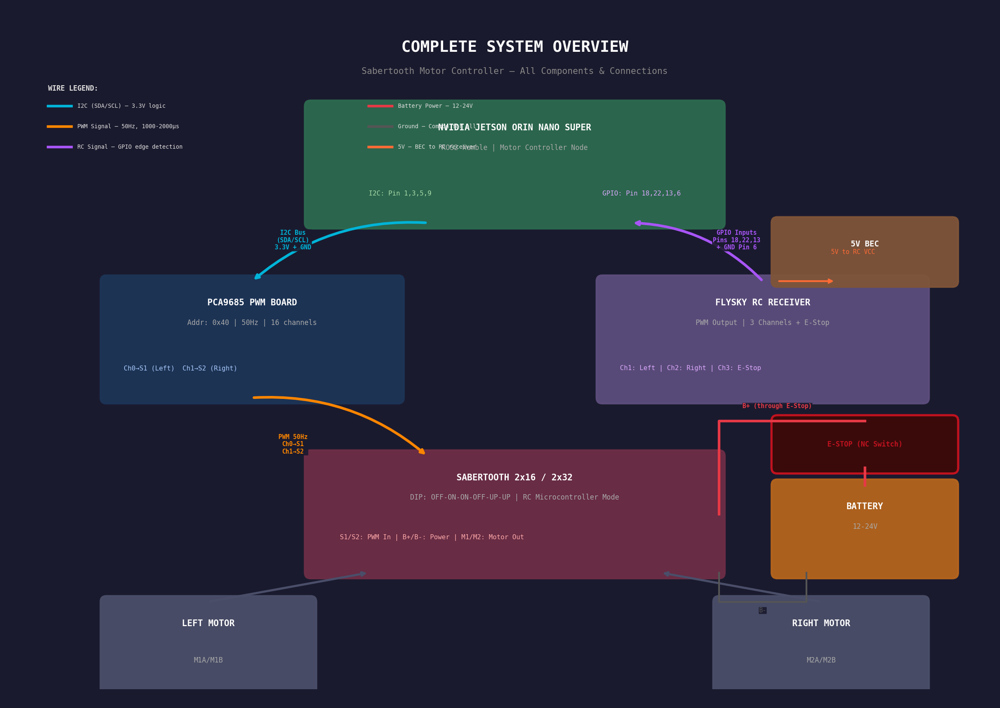
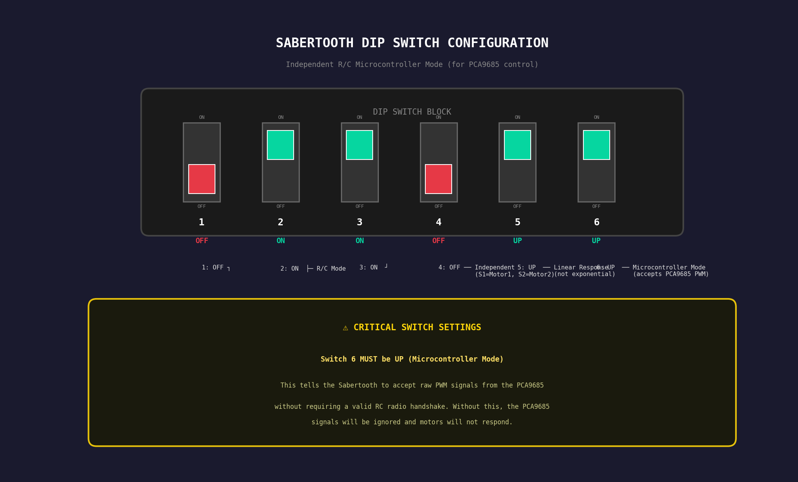

# Sabertooth Motor Controller - ROS2 Humble

ROS2 Humble driver for Dimension Engineering Sabertooth 2x16/2x32 motor controllers via PCA9685 PWM. Designed for tank-drive robots used at conventions around children, with safety as the top priority.

## Features

- **Tank drive** with modular kinematics (easy to add other drive types)
- **Safety state machine** with command timeout, acceleration limiting, and speed caps
- **RC radio override** - physical transmitter always takes priority over software
- **Hardware e-stop** support - physical kill switch cuts motor power instantly
- **Software e-stop** via ROS2 service
- **Simulation mode** for testing on MacBook without hardware
- **Compatible** with both Sabertooth 2x16 and 2x32
- **Fully configurable** via ROS2 parameters and YAML files

## Table of Contents

1. [Safety Architecture](#safety-architecture)
2. [Hardware Requirements](#hardware-requirements)
3. [Wiring Diagrams](#wiring-diagrams)
   - [Main System Wiring](#main-system-wiring)
   - [RC Receiver Wiring](#rc-receiver-wiring)
   - [E-Stop & Battery Wiring](#e-stop--battery-wiring)
   - [PWM Signal Timing](#pwm-signal-timing)
   - [Complete System Diagram](#complete-system-diagram)
4. [Sabertooth DIP Switch Configuration](#sabertooth-dip-switch-configuration)
5. [Software Installation](#software-installation)
6. [Configuration](#configuration)
7. [Usage](#usage)
8. [ROS2 Interface](#ros2-interface)
9. [Testing](#testing)
10. [Troubleshooting](#troubleshooting)
11. [Architecture Overview](#architecture-overview)
12. [Modifying the Code](#modifying-the-code)

---

## Safety Architecture

**This robot operates around children. Safety is non-negotiable.**

### Safety Layers (highest priority first)

| Layer | Type | Description |
|-------|------|-------------|
| 1. Hardware E-Stop | Physical switch | Cuts battery power to Sabertooth. Instant motor stop. |
| 2. RC E-Stop Channel | Radio + Software | Toggle switch on RC transmitter triggers software e-stop |
| 3. RC Override | Radio + Software | RC transmitter takes exclusive motor control when active |
| 4. Software E-Stop | ROS2 Service | `/estop` service can be called by any node |
| 5. Command Timeout | Software | Motors stop if no command received within timeout (default 500ms) |
| 6. Acceleration Limiting | Software | Prevents sudden jerky movements |
| 7. Speed Limiting | Software | Per-mode maximum speed caps (teleop, autonomous, RC) |
| 8. Startup Delay | Software | Rejects commands for 1 second after boot |

### Hardware E-Stop (REQUIRED for convention use)

You MUST install a physical emergency stop button. This is a normally-closed (NC) switch wired in series with the positive battery lead to the Sabertooth. When pressed, it breaks the circuit and kills ALL motor power instantly, regardless of software state.

### Safety State Machine

```
INITIALIZING --> NORMAL (after startup delay)
NORMAL --> TIMEOUT (no commands within timeout)
NORMAL --> RC_OVERRIDE (RC signals detected)
NORMAL --> ESTOP (e-stop triggered)
TIMEOUT --> NORMAL (new command received)
RC_OVERRIDE --> NORMAL (RC signal lost)
ANY --> ESTOP (e-stop from any state)
ESTOP --> NORMAL (release + reset service call)
ANY --> ERROR (hardware fault)
```

**INVARIANT: In ESTOP, TIMEOUT, INITIALIZING, and ERROR states, motors are forced to neutral (stopped) on EVERY control cycle. No code path can move motors in these states.**

---

## Hardware Requirements

| Component | Model | Purpose |
|-----------|-------|---------|
| Computer | NVIDIA Jetson Orin Nano Super | Main controller |
| Motor Controller | Sabertooth 2x16 or 2x32 | DC motor driver |
| PWM Board | PCA9685 16-channel | I2C to PWM conversion |
| RC Receiver | FlySky (or compatible PWM) | Remote control override |
| RC Transmitter | FlySky (or compatible) | Operator remote control |
| E-Stop Button | Normally-Closed momentary | Emergency power cutoff |
| DC Motors | 2x (matched pair) | Drive motors |
| Battery | 12V-24V LiPo/SLA | Power supply |

---

## Wiring Diagrams

### Main System Wiring



```
JETSON ORIN NANO (40-Pin Header)
================================
Pin 1  (3.3V) -----> PCA9685 VCC (logic power, MUST be 3.3V)
Pin 3  (SDA)  -----> PCA9685 SDA
Pin 5  (SCL)  -----> PCA9685 SCL
Pin 9  (GND)  -----> PCA9685 GND
Pin 6  (GND)  -----> RC Receiver GND (shared ground)
Pin 18 (GPIO) <----- RC Receiver Ch1 Signal (left/right)
Pin 22 (GPIO) <----- RC Receiver Ch2 Signal (forward/back)
Pin 13 (GPIO) <----- RC Receiver Ch3 Signal (e-stop switch)


PCA9685 PWM Board (Address: 0x40, Frequency: 50Hz)
===================================================
VCC  <---- Jetson Pin 1 (3.3V)
GND  <---- Jetson Pin 9 (GND)
SDA  <---- Jetson Pin 3 (SDA)
SCL  <---- Jetson Pin 5 (SCL)
Ch0  SIG -----> Sabertooth S1 (Left Motor)
Ch1  SIG -----> Sabertooth S2 (Right Motor)
Ch2-15   -----> Reserved for future (head, arms, etc.)


SABERTOOTH 2x16 / 2x32
=======================
S1  <---- PCA9685 Ch0 (Left Motor PWM signal)
S2  <---- PCA9685 Ch1 (Right Motor PWM signal)
0V  <---- Common GND (connect to PCA9685 GND)
B+  <---- Battery + (through E-STOP switch)
B-  <---- Battery -
M1A/M1B -----> Left Drive Motor
M2A/M2B -----> Right Drive Motor


BATTERY & E-STOP
=================
Battery (+) ----> [E-STOP SWITCH] ----> Sabertooth B+
Battery (-) ----> Sabertooth B-

E-Stop: Normally-Closed (NC) switch in series with B+
  - Switch released (closed) = power ON = motors can run
  - Switch pressed (open)    = power OFF = motors stop instantly


RC RECEIVER (FlySky / compatible)
=================================
VCC  <---- 5V BEC or separate 5V regulator (NOT Jetson 3.3V!)
GND  <---- Jetson Pin 6 (shared ground)
Ch1  SIG -----> Jetson Pin 18 (GPIO)
Ch2  SIG -----> Jetson Pin 22 (GPIO)
Ch3  SIG -----> Jetson Pin 13 (GPIO)

NOTE: RC signal levels (3.3V-5V) are safe for Jetson GPIO inputs.
```

### RC Receiver Wiring



### E-Stop & Battery Wiring



### PWM Signal Timing



### Complete System Diagram



```
                     ┌─────────────────────────┐
                     │   NVIDIA JETSON ORIN     │
                     │       NANO SUPER         │
                     │                          │
     I2C Bus ------->│ Pin 3 (SDA)              │
     (to PCA9685)    │ Pin 5 (SCL)              │
                     │ Pin 1 (3.3V)             │
                     │ Pin 9 (GND)              │
                     │                          │
     RC Input ------>│ Pin 18 (RC Ch1)          │
     (from receiver) │ Pin 22 (RC Ch2)          │
                     │ Pin 13 (RC Ch3/E-Stop)   │
                     │ Pin 6  (GND)             │
                     └─────────────────────────┘
                                |
                          I2C Bus (SDA/SCL)
                                |
                     ┌─────────────────────────┐
                     │     PCA9685 PWM Board    │
                     │     Address: 0x40        │
                     │     Frequency: 50Hz      │
                     │                          │
                     │  Ch0 ──── Sabertooth S1  │
                     │  Ch1 ──── Sabertooth S2  │
                     │  Ch2-15 ─ (future)       │
                     └─────────────────────────┘
                                |
                          PWM Signals (50Hz)
                                |
    ┌───────────┐    ┌─────────────────────────┐
    │           │    │   SABERTOOTH 2x16/2x32  │
    │  BATTERY  │    │                          │
    │  12-24V   ├──┐ │  S1 (Left Motor PWM)    │
    │           │  │ │  S2 (Right Motor PWM)    │
    └───────────┘  │ │                          │
                   │ │  M1A ──┐   M2A ──┐      │
         [E-STOP]──┘ │  M1B ──┤   M2B ──┤      │
          switch     │       │         │       │
                     │  B+ ←─┘   B- ←─┘       │
                     └─────────────────────────┘
                               |           |
                         ┌─────┘           └─────┐
                    ┌────┴────┐           ┌────┴────┐
                    │  LEFT   │           │  RIGHT  │
                    │  MOTOR  │           │  MOTOR  │
                    └─────────┘           └─────────┘
```

### Voltage Reference

| Connection | Voltage | Notes |
|-----------|---------|-------|
| Jetson -> PCA9685 VCC | 3.3V | MUST use 3.3V, NOT 5V |
| PCA9685 -> Sabertooth Signal | 3.3V logic | Safe for Sabertooth |
| RC Receiver VCC | 5V | From BEC, NOT from Jetson |
| RC Signal -> Jetson GPIO | 3.3-5V | Safe for Jetson inputs |
| Battery -> Sabertooth | 12-24V | Through E-Stop switch |

---

## Sabertooth DIP Switch Configuration

Set the Sabertooth DIP switches for **Independent R/C Microcontroller Mode**:



```
DIP Switch Settings:
┌─────┬─────┬─────┬─────┬─────┬─────┐
│  1  │  2  │  3  │  4  │  5  │  6  │
├─────┼─────┼─────┼─────┼─────┼─────┤
│ OFF │ ON  │ ON  │ OFF │ UP  │ UP  │
│  v  │  ^  │  ^  │  v  │  ^  │  ^  │
└─────┴─────┴─────┴─────┴─────┴─────┘

Switch 1-3: OFF-ON-ON = R/C mode
Switch 4:   OFF       = Independent mode (S1=Motor1, S2=Motor2)
Switch 5:   UP        = Linear response (not exponential)
Switch 6:   UP        = Microcontroller mode (accepts PCA9685 PWM directly)
```

**Switch 6 MUST be UP** for PCA9685 control. This tells the Sabertooth to accept raw PWM signals without requiring a valid RC radio handshake.

---

## Software Installation

### Prerequisites

#### On Jetson Orin Nano (Production)

```bash
# ROS2 Humble should be installed via JetPack or manual install
# Verify:
ros2 --version

# Enable I2C permissions:
sudo usermod -aG i2c $USER
# Reboot after this!

# Install Python hardware dependencies:
pip3 install adafruit-circuitpython-pca9685 Adafruit-Blinka

# Install teleop keyboard (for testing):
sudo apt install ros-humble-teleop-twist-keyboard

# Optional: Install joystick teleop
sudo apt install ros-humble-teleop-twist-joy
```

#### On MacBook Pro (Development/Testing)

```bash
# ROS2 Humble - install via your preferred method
# (Docker, homebrew, or build from source)

# No hardware dependencies needed - simulation mode auto-detected
```

### Build the Package

```bash
cd /path/to/motor_controller

# Build everything (msgs package must build first):
colcon build --packages-select sabertooth_motor_controller_msgs
source install/setup.bash
colcon build --packages-select sabertooth_motor_controller
source install/setup.bash

# Or build all at once (colcon handles dependency order):
colcon build
source install/setup.bash
```

### Verify I2C (Jetson only)

```bash
# Check if PCA9685 is detected at address 0x40:
sudo i2cdetect -y -r 1

# Expected output shows "40" in the grid:
#      0  1  2  3  4  5  6  7  8  9  a  b  c  d  e  f
# 40: 40 -- -- -- -- -- -- -- -- -- -- -- -- -- -- --

# If not on bus 1, try bus 7:
sudo i2cdetect -y -r 7
# Then update the i2c_bus parameter in your config YAML
```

---

## Configuration

All parameters are in `config/default_params.yaml`. Key parameters to customize:

### For Your Robot

```yaml
kinematics:
  wheel_separation_m: 0.45    # Measure YOUR robot's wheel spacing
  wheel_radius_m: 0.075       # Measure YOUR wheel radius
  left_motor_inverted: false   # Set true if left motor runs backwards
  right_motor_inverted: false  # Set true if right motor runs backwards
```

### Safety Tuning

```yaml
safety:
  command_timeout_ms: 500      # Lower for conventions (250), higher for dev (1000)
  max_speed_teleop: 0.6        # Max teleop speed (0.0-1.0)
  max_speed_autonomous: 0.4    # Max autonomous speed
  accel_limit: 2.0             # Smoothness vs responsiveness tradeoff
```

### For Sabertooth 2x32

Use the override config file:

```bash
ros2 launch sabertooth_motor_controller motor_controller.launch.py \
  config_file:=$(ros2 pkg prefix sabertooth_motor_controller)/share/sabertooth_motor_controller/config/sabertooth_2x32_params.yaml
```

---

## Usage

### Start Motor Controller (Jetson with hardware)

```bash
ros2 launch sabertooth_motor_controller motor_controller.launch.py
```

### Start in Simulation Mode (MacBook or no hardware)

```bash
ros2 launch sabertooth_motor_controller motor_controller.launch.py simulation_mode:=true
```

### Teleop with Keyboard

```bash
# Terminal 1: Start motor controller
ros2 launch sabertooth_motor_controller motor_controller.launch.py simulation_mode:=true

# Terminal 2: Start teleop keyboard
ros2 run teleop_twist_keyboard teleop_twist_keyboard

# Or use the combined launch file:
ros2 launch sabertooth_motor_controller teleop.launch.py simulation_mode:=true
```

Keyboard controls:
```
u    i    o        (forward-left, forward, forward-right)
j    k    l        (turn-left, stop, turn-right)
m    ,    .        (back-left, backward, back-right)

q/z: increase/decrease max speed by 10%
w/x: increase/decrease linear speed by 10%
e/c: increase/decrease angular speed by 10%
```

### Web GUI

A browser-based dashboard for driving, monitoring, and E-Stop control. Works on desktop, tablet, and phone.

```bash
# Launch motor controller + web GUI together:
ros2 launch sabertooth_motor_controller gui.launch.py simulation_mode:=true

# Then open in any browser:
#   http://localhost:5000
#   http://<jetson-ip>:5000  (from another device on the network)

# Custom port:
ros2 launch sabertooth_motor_controller gui.launch.py simulation_mode:=true gui_port:=8080
```

Web GUI controls:
```
W / Arrow Up      Forward
S / Arrow Down    Backward
A / Arrow Left    Turn left
D / Arrow Right   Turn right
Space             E-Stop toggle
Q / E             Increase / decrease speed
```

The GUI also shows real-time motor status, safety state, and direction indicators that light up based on actual motor output from **any** command source (RC, teleop, autonomous).

Requires `flask` (`pip install flask` or `sudo apt install python3-flask`).

### Manual Command Publishing

```bash
# Forward at 30% speed:
ros2 topic pub /cmd_vel geometry_msgs/msg/Twist \
  "{linear: {x: 0.3}, angular: {z: 0.0}}" --rate 10

# Turn left while moving forward:
ros2 topic pub /cmd_vel geometry_msgs/msg/Twist \
  "{linear: {x: 0.3}, angular: {z: 0.5}}" --rate 10

# Spin in place (pivot left):
ros2 topic pub /cmd_vel geometry_msgs/msg/Twist \
  "{linear: {x: 0.0}, angular: {z: 0.5}}" --rate 10

# Stop (or just stop publishing - timeout will stop motors):
ros2 topic pub /cmd_vel geometry_msgs/msg/Twist \
  "{linear: {x: 0.0}, angular: {z: 0.0}}" --once
```

### Emergency Stop

```bash
# Engage e-stop:
ros2 service call /estop std_srvs/srv/SetBool "{data: true}"

# Release e-stop:
ros2 service call /estop std_srvs/srv/SetBool "{data: false}"

# Reset to normal operation (after releasing e-stop):
ros2 service call /reset std_srvs/srv/Trigger
```

### Monitor Status

```bash
# Watch motor status:
ros2 topic echo /motor_status

# Check specific fields:
ros2 topic echo /motor_status --field safety_state
ros2 topic echo /motor_status --field left_speed_actual
ros2 topic echo /motor_status --field rc_connected
```

---

## ROS2 Interface

### Subscribed Topics

| Topic | Type | Description |
|-------|------|-------------|
| `/cmd_vel` | `geometry_msgs/Twist` | Standard navigation velocity commands. `linear.x` = forward/back, `angular.z` = rotation. Compatible with nav2, teleop_twist_keyboard, joy_teleop. |
| `/motor_cmd` | `MotorCommand` | Direct motor control. `left_speed` and `right_speed` (-1.0 to 1.0) bypass kinematics. |

### Published Topics

| Topic | Type | Rate | Description |
|-------|------|------|-------------|
| `/motor_status` | `MotorStatus` | 10 Hz | Complete controller status: speeds, safety state, RC diagnostics |

### Services

| Service | Type | Description |
|---------|------|-------------|
| `/estop` | `std_srvs/SetBool` | Engage (`true`) or release (`false`) software e-stop |
| `/reset` | `std_srvs/Trigger` | Reset from ESTOP or ERROR state back to NORMAL |

### Parameters

See `config/default_params.yaml` for the complete parameter list with descriptions.

---

## Testing

### Unit Tests (any platform, no hardware)

```bash
cd /path/to/motor_controller

# Run all tests:
cd src/sabertooth_motor_controller
pytest test/ -v

# Run specific test file:
pytest test/test_kinematics.py -v
pytest test/test_safety.py -v
pytest test/test_sabertooth_driver.py -v
pytest test/test_pca9685_driver.py -v

# Or via colcon:
colcon test --packages-select sabertooth_motor_controller
colcon test-result --verbose
```

### Hardware Validation (Jetson only)

1. **I2C detection**: `sudo i2cdetect -y -r 1` - verify PCA9685 at 0x40
2. **Start node**: Launch motor controller, watch for "HARDWARE mode" log
3. **Neutral test**: Verify motors are stopped at startup
4. **Forward test**: `ros2 topic pub /cmd_vel ... linear.x=0.3` - both motors forward
5. **Turn test**: `ros2 topic pub /cmd_vel ... angular.z=0.5` - differential turn
6. **Timeout test**: Publish one command, wait >500ms, verify motors stop
7. **E-stop test**: `ros2 service call /estop ...` - verify immediate stop
8. **Shutdown test**: Ctrl+C the node, verify motors return to neutral

---

## Troubleshooting

### PCA9685 not detected

```bash
# Check I2C bus:
sudo i2cdetect -y -r 1
# If empty, try bus 7:
sudo i2cdetect -y -r 7
# Then update config: hardware.i2c_bus: 7

# Check permissions:
groups  # Should include 'i2c'
# If not: sudo usermod -aG i2c $USER && reboot
```

### Motors not moving

1. Check Sabertooth DIP switches (see above)
2. Check battery voltage and E-Stop switch
3. Verify PCA9685 frequency is 50Hz (check logs)
4. Check motor wiring (M1A/M1B, M2A/M2B)
5. Run with `log_level:=debug` to see PWM values

### Motors running wrong direction

Set `kinematics.left_motor_inverted: true` or `right_motor_inverted: true` in the config YAML.

### RC override not working

1. Verify RC receiver is powered (5V BEC, not Jetson 3.3V)
2. Check GPIO pin numbers match config
3. Check RC transmitter is bound to receiver
4. Run with `log_level:=debug` to see RC pulse values in `/motor_status`

### Node falls back to simulation mode unexpectedly

The node auto-detects hardware. If PCA9685 is not found on I2C, it falls back to mock mode. Check I2C wiring and bus number.

---

## Architecture Overview

```
                    /cmd_vel (Twist)        /motor_cmd (MotorCommand)
                         │                         │
                         ▼                         ▼
              ┌─────────────────────────────────────────────┐
              │         motor_controller_node.py             │
              │                                              │
              │  ┌──────────────┐   ┌───────────────────┐  │
              │  │  drive_       │   │  Direct motor     │  │
              │  │  kinematics   │   │  speed passthrough│  │
              │  │  (Twist →     │   │                   │  │
              │  │   L/R speeds) │   │                   │  │
              │  └──────┬───────┘   └────────┬──────────┘  │
              │         │                     │              │
              │         └─────────┬───────────┘              │
              │                   ▼                          │
              │    ┌──────────────────────────┐              │
              │    │    Command Arbitration    │              │
              │    │  RC > Teleop > Autonomous│◄── rc_input  │
              │    └────────────┬─────────────┘              │
              │                 ▼                             │
              │    ┌──────────────────────────┐              │
              │    │    safety_monitor.py      │              │
              │    │  State machine + limits   │              │
              │    │  Speed cap + Accel ramp   │              │
              │    └────────────┬─────────────┘              │
              │                 ▼                             │
              │    ┌──────────────────────────┐              │
              │    │   sabertooth_driver.py    │              │
              │    │  Speed → PWM pulse width  │              │
              │    └────────────┬─────────────┘              │
              │                 ▼                             │
              │    ┌──────────────────────────┐              │
              │    │   pca9685_driver.py       │              │
              │    │   (or mock_hardware.py)   │              │
              │    └────────────┬─────────────┘              │
              └─────────────────┼──────────────────────────  │
                                ▼
                         I2C Bus to PCA9685
                                │
                         PWM Signals (50Hz)
                                │
                         Sabertooth S1/S2
                                │
                         DC Motors L/R
```

### Module Responsibilities

| Module | Role | Dependencies |
|--------|------|-------------|
| `motor_controller_node.py` | ROS2 orchestrator | All other modules |
| `drive_kinematics.py` | Twist → motor speeds | None (pure math) |
| `safety_monitor.py` | State machine, speed/accel limits | None (pure Python) |
| `sabertooth_driver.py` | Speed → PWM duty cycle | pca9685_driver |
| `pca9685_driver.py` | I2C hardware abstraction | adafruit_pca9685 |
| `rc_input.py` | GPIO PWM reading | Jetson.GPIO |
| `mock_hardware.py` | Mock drivers for testing | None |

---

## Modifying the Code

### Adding a New Drive Type

1. Open `drive_kinematics.py`
2. Create a new class implementing the `DriveKinematics` protocol:
   ```python
   class MecanumKinematics:
       def twist_to_motor_speeds(self, linear_x, angular_z):
           # Your kinematics math here
           return (left_speed, right_speed)
   ```
3. Add it to the `create_kinematics()` factory function
4. Set `kinematics.type: "mecanum"` in your config YAML

### Adding More Motors (head, arms)

1. Add new PCA9685 channel parameters in the config YAML
2. Create additional channel references in `motor_controller_node.py`
3. Add new topics/services for the additional actuators
4. The PCA9685 has 16 channels - plenty for head pan/tilt, arms, etc.

### Changing Speed Limits

Edit `config/default_params.yaml`:
```yaml
safety:
  max_speed_teleop: 0.6       # Adjust teleop max speed
  max_speed_autonomous: 0.4   # Adjust autonomous max speed
  accel_limit: 2.0            # Adjust acceleration smoothness
```

### Adjusting for a New Robot

1. Measure wheel separation and radius
2. Update `kinematics.wheel_separation_m` and `kinematics.wheel_radius_m`
3. Test motor direction - set `left_motor_inverted` / `right_motor_inverted` if needed
4. Tune speed limits and acceleration for the robot's weight and environment

---

## License

MIT License
